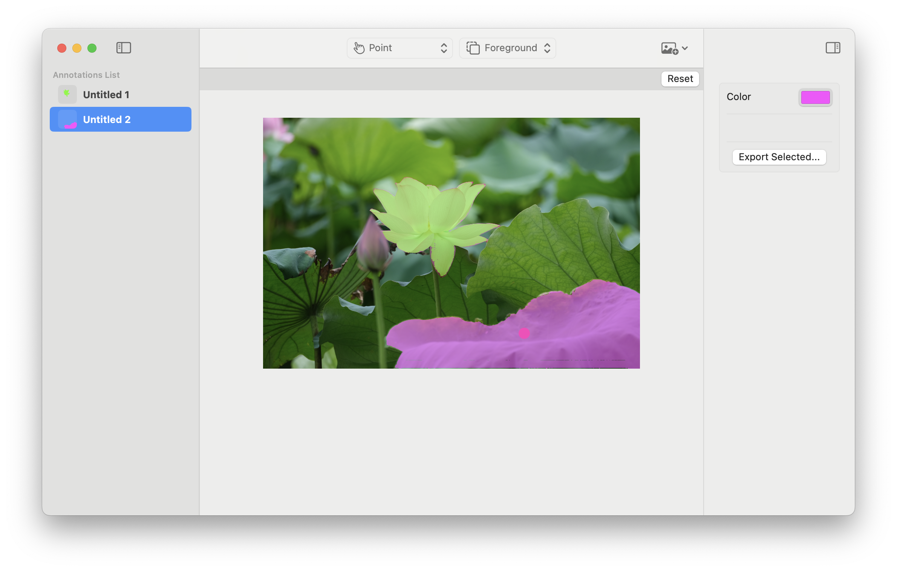

# SAM2 Studio

This is a Swift demo app for SAM 2 Core ML models.



SAM 2 (Segment Anything in Images and Videos), is a collection of foundation models from FAIR that aim to solve promptable visual segmentation in images and videos. See the [SAM 2 paper](https://arxiv.org/abs/2408.00714) for more information.

## How to Use

Download the repo, compile with Xcode and run. The app comes with the Large version of the model, but you can replace it with one of the supported models:

- [SAM 2 Tiny](https://huggingface.co/coreml-projects/coreml-sam2-tiny/edit/main/README.md)
- [SAM 2 Small](https://huggingface.co/coreml-projects/coreml-sam2-small/edit/main/README.md)
- [SAM 2 Base](https://huggingface.co/coreml-projects/coreml-sam2-base/edit/main/README.md)
- [SAM 2 Large](https://huggingface.co/coreml-projects/coreml-sam2-large/edit/main/README.md)

This demo supports images, video support will be coming later.

### Selecting Objects

- You can select one or more _foreground_ points to choose objects in the image.
- Use a _background_ point to refine your selection by removing areas.
- You can use a _box_ to select an approximate area that contains the object you're interested in. In Box selection mode, the points are considered _refinements_ of the box, and not independent selections.

## Converting Models

If you want to use a fine-tuned model, you can convert it using [this fork of the SAM 2 repo](https://github.com/huggingface/segment-anything-2/tree/coreml-conversion). Please, let us know what you use it for!

## Feedback and Contributions

Feedback, issues and PRs are welcome! Please, feel free to [get in touch](https://github.com/huggingface/sam2-swiftui/issues/new).

## Citation

To cite the SAM 2 paper, model, or software, please use the below:

```
@article{ravi2024sam2,
  title={SAM 2: Segment Anything in Images and Videos},
  author={Ravi, Nikhila and Gabeur, Valentin and Hu, Yuan-Ting and Hu, Ronghang and Ryali, Chaitanya and Ma, Tengyu and Khedr, Haitham and R{\"a}dle, Roman and Rolland, Chloe and Gustafson, Laura and Mintun, Eric and Pan, Junting and Alwala, Kalyan Vasudev and Carion, Nicolas and Wu, Chao-Yuan and Girshick, Ross and Doll{\'a}r, Piotr and Feichtenhofer, Christoph},
  journal={arXiv preprint arXiv:2408.00714},
  url={https://arxiv.org/abs/2408.00714},
  year={2024}
}
```


